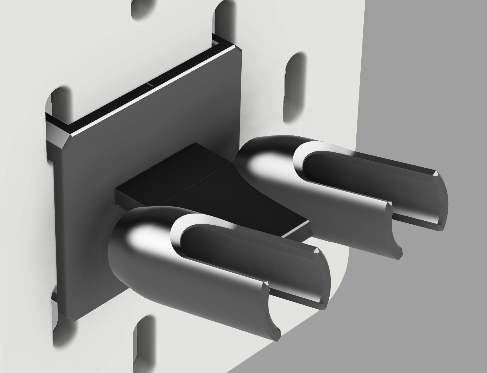
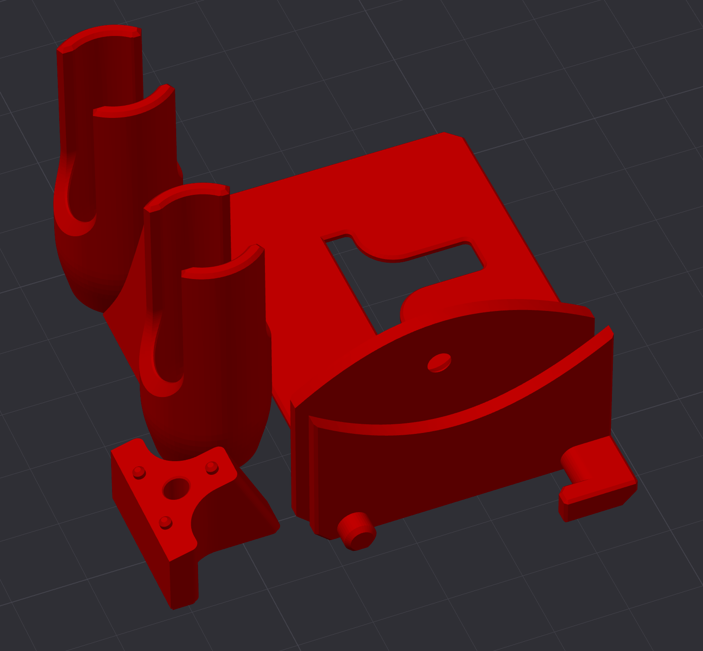
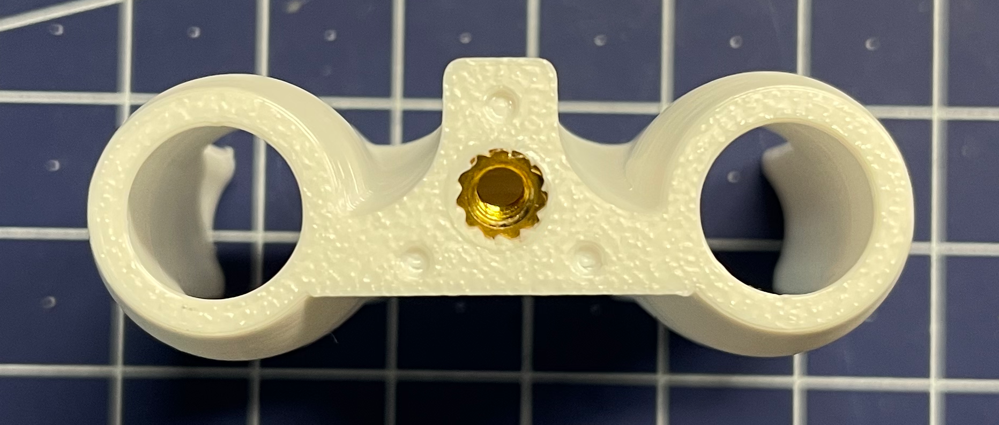
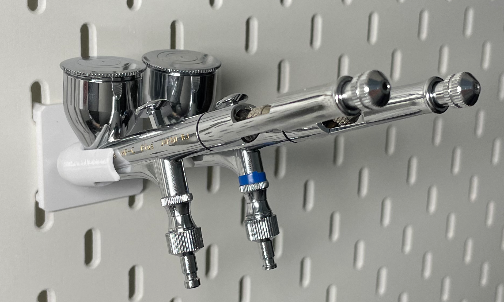
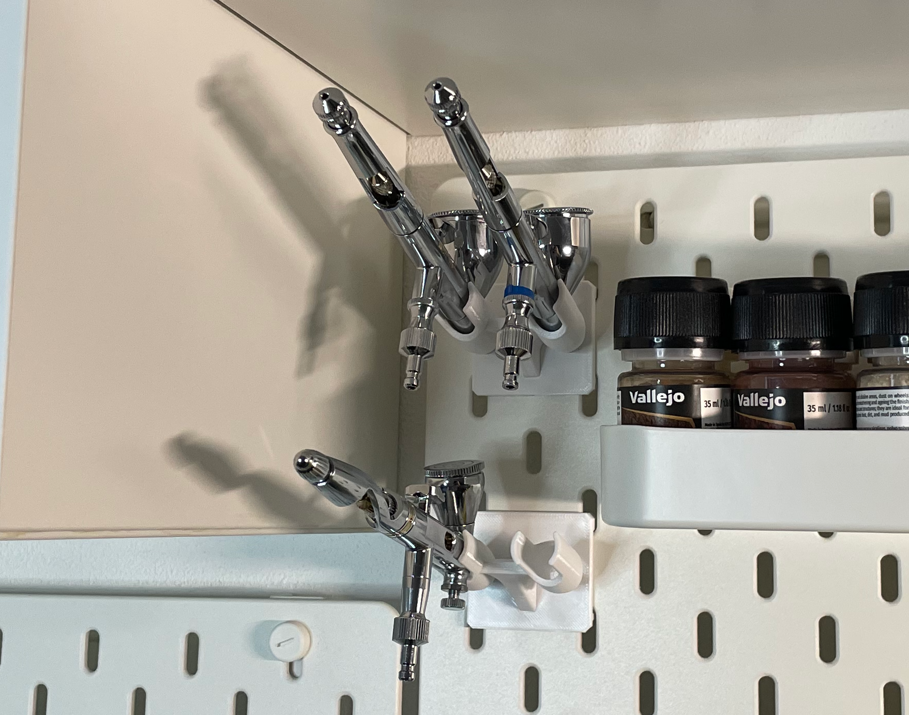

# airbrush-holder

Upgrade your workspace with a custom-designed airbrush holder for the IKEA Skådis system. Save space and improve accessibility, 
keeping your airbrushes secure and ready to use. Designed for strength and easy 3D printing, this holder is tested with models like the 
Iwata CP-HP and Gaahleri Mobius, making it a reliable addition for any airbrushing enthusiast.

---

I have developed a holder for two airbrushes designed to be compatible with the IKEA Skådis system. The airbrushes are inserted 
perpendicular to the Skådis panel, which not only saves space but also improves accessibility to the airbrushes, making it more convenient 
to grab and return them during use. This design ensures that the airbrushes are securely held while remaining easy to access.

The holder is constructed with five separate parts, optimized for 3D printing without the need for supports. The components are glued 
together using cyanoacrylate adhesive, which offers a strong and reliable bond. For those seeking additional durability, 
a threaded insert (M3x4x5 - Voron type) can be installed, paired with an M3x18mm countersunk screw. 
This screw is discreetly inserted from the back, ensuring a clean aesthetic and robust connection. On the print bed view, 
you can see the optimal orientation of the parts for efficient printing.

Recommended print options:
* 0.2mm layer height
* 0.4mm line width
* Wall count 3+
* No supports
* PETG

> In terms of assembly, the "airbrush-holder" and "mount-C" do not require adhesive if a locking screw is utilized. However, it is essential 
to glue "mount-A" and "mount-B" to the cover to ensure stability. The use of glue in this context is a practical compromise, 
balancing ease of assembly with structural integrity. This approach is both elegant and efficient, avoiding the complexity of designing 
intricate locking mechanisms or compromising the print's layer orientation for certain parts.

The design has been tested with a variety of airbrush models, including the Iwata CP-HP and the Gaahleri Mobius, confirming its 
versatility and secure fit for different airbrush types. The result is a sleek, practical solution that caters to both professional 
and hobbyist needs, offering a tidy and functional addition to the Skådis system.

---
Copyright 2025 Michal Kelnar
